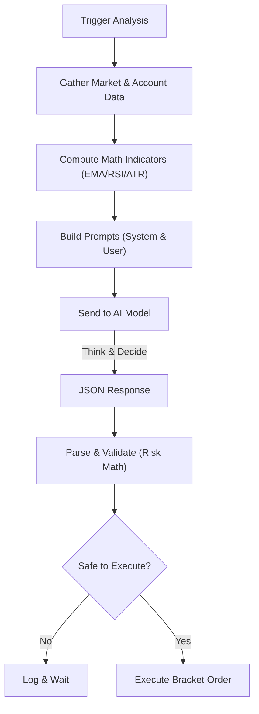

# How Auto-Trader-Ahh Works: A Deep Dive

This document details the end-to-end architecture, mathematical models, and execution logic of the **Auto-Trader-Ahh** system. It explains *exactly* how raw market data is transformed into executed orders on the exchange.

---

## 1. The Core Architecture (The Engine)

The system is built around a central event loop in `server/trader/engine.go` that operates on a customizable heartbeat (default: 5 minutes).

### The Event Loop
1.  **Trigger**: A Golang `time.Ticker` wakes up the `tradingLoop`.
2.  **Context Synchronization**: The engine locks the mutex (`e.mu.Lock()`) to fetch the latest state (positions, balances) from the Exchange (Binance).
3.  **Sequential Processing**: It iterates through every configured trading pair (e.g., `BTCUSDT`, `ETHUSDT`) sequentially, adding a small delay (2s) between them to respect API rate limits.

---

## 2. Market Data Analysis (The Inputs)

Before involving the AI, the system performs deterministic mathematical analysis using the `MarketData` provider (`server/market/data.go`).

### Mathematical Indicators
The system calculates the following technical indicators on the fly:

#### A. Exponential Moving Average (EMA)
Used for trend identification.

$$
multiplier = \frac{2}{period + 1}
$$

$$
EMA_{today} = (Price_{today} \times multiplier) + (EMA_{yesterday} \times (1 - multiplier))
$$

*   **EMA9**: Fast moving average (9 periods)
*   **EMA21**: Slow moving average (21 periods)
*   **Trend Logic**: If `EMA9 > EMA21`, the trend is **BULLISH**.

#### B. Relative Strength Index (RSI)
Used to detect overbought/oversold conditions.

$$
RSI = 100 - \frac{100}{1 + RS}
$$

Where:

$$
RS = \frac{\text{Average Gain}}{\text{Average Loss}}
$$

(over 14 periods)

*   **Condition**: RSI > 70 is **Overbought**, RSI < 30 is **Oversold**.

#### C. Average True Range (ATR)_
Used to measure volatility for stop-loss sizing.

$$
TR = \max(High - Low, |High - Close_{prev}|, |Low - Close_{prev}|)
$$

$$
ATR = \frac{1}{n} \sum_{i=1}^{n} TR_i
$$

---

## 3. The AI Decision Process (The "Brain")

The system does not just "ask" the AI. It constructs a highly specific prompt context (`server/decision/prompt_builder.go`) to force a structured output.

### A. Context Injection (The Prompt)
The AI receives a formatted text block containing:
1.  **Account State**: Equity, Margin Used %, Unrealized PnL.
2.  **Market Data**: The calculated EMA, RSI, MACD values, plus the last 100 candlesticks (Open, High, Low, Close).
3.  **Active Positions**: Detailed metadata about any open trade for this symbol (Entry Price, Current PnL %).

### B. Inference & Streaming
The request is sent to an AI provider (e.g., OpenRouter) utilizing **streaming capabilities**.
*   **Streaming**: The system flushes tokens as they arrive. This is critical for models like `deepseek-r1` or `o1` which generate extensive "Chain of Thought" (CoT) reasoning before the final answer.
*   **Chain of Thought**: The system captures the `<reasoning>` block where the AI "thinks out loud" about support levels, market psychology, and indicator divergence.

### C. Output Schema
The AI must conclude with a specific JSON block.
```json
{
  "action": "open_long",
  "confidence": 85,
  "reasoning": "RSI divergent on 1H timeframe, EMA9 crossing EMA21...",
  "stop_loss": 98500,
  "take_profit": 102000
}
```

---

## 4. Validation & Risk Management (The Math)

This is the most critical safety layer. Even if the AI says "BUY", the code (`server/decision/validator.go`) applies strict mathematical constraints.

### A. Risk/Reward Ratio
The system enforces a minimum **3:1** Reward-to-Risk ratio.

$$
\text{Risk} = \frac{|Entry - StopLoss|}{Entry}
$$

$$
\text{Reward} = \frac{|TakeProfit - Entry|}{Entry}
$$

$$
\text{Ratio} = \frac{\text{Reward}}{\text{Risk}}
$$

*   **Rule**: If `Ratio < 3.0`, the trade is **REJECTED** immediately.

### B. Position Sizing
*   **Formula**: `PositionSizeUSD = AvailableBalance * (PositionPct / 100) * Leverage`
*   **Hard Caps**:
    *   **BTC/ETH**: Max Leverage 20x, Max 30% of Equity per trade.
    *   **Altcoins**: Max Leverage 10x, Max 15% of Equity per trade.

### C. PnL Protections (Smart Loss Management V2)
To prevent "death by a thousand cuts" in choppy markets while still allowing safe exits:

1.  **Relaxed Cut-Loss**: The bot is **allowed** to cut a loss early ONLY if `PnL < -1.2%`.
    *   *Why*: At 20x leverage, -1.2% price = -24% equity. We allow room for noise.
2.  **Noise Filter**: Between **-1.2%** and **+1.0%** PnL, closing is **BLOCKED** to prevent panic selling in noise.
3.  **Confidence Override**: If AI Confidence > **90%**, it can override the noise filter (rare).
4.  **Profit Taking**: Can close early if `Profit > 1.0%`.

---

## 5. Execution Logic (The "Hands")

When a decision is validated, the `Trader` engine executes it via the Binance API.

### Bracket Orders Execution
The system mimics "Bracket Orders" (atomic Entry + SL + TP) by managing three separate actions:

1.  **Entry Order**: A `MARKET` order is placed immediately to enter the position.
2.  **Stop Loss (SL)**: A `STOP_MARKET` order is placed at the calculated stop price.
    *   *Trigger*: `Last Price <= SL Price` (Long)
3.  **Take Profit (TP)**: A `TAKE_PROFIT_MARKET` order is placed at the calculated target.
    *   *Trigger*: `Last Price >= TP Price` (Long)

### Lifecycle Management
*   **Monitoring**: The system tracks these Order IDs (`StopLossOrderID`, `TakeProfitOrderID`) in memory.
*   **Cleanup**: If the position is manually closed or hits TP, the system automatically cancels the hanging SL order (and vice versa) to prevent accidental execution.

---

## Summary Flowchart


